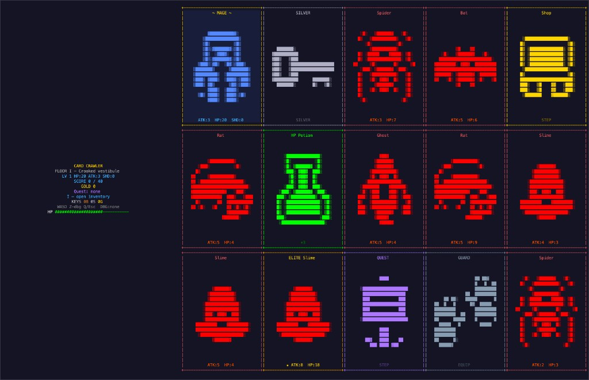

# Code 437 (Card Crawler)

Code 437 is a terminal/Emuterm ASCII roguelite built with Kotlin + [CosPlay](https://cosplayengine.org/).
You move one tile per turn on a `5x3` card grid, fight enemies, collect upgrades/resources, complete quests, and clear floors by reaching score targets.

## Core Loop

Each player action follows this flow:

1. Input movement (`WASD` / arrows).
2. Resolve movement blockers and collisions (walls, bombs, locked chests).
3. Apply tile interactions (loot, combat, hazards, chest open/claim, scene triggers).
4. Repack the vacated row/column with slide animation and fresh spawns.
5. Tick bomb countdowns and resolve detonations.
6. Check post-move routing (shop, level complete, etc.).

## Feature Summary

### Combat and Progression

- Turn-based enemy combat with attack exchanges and defeat checks.
- Level-based score targets across 10 floors.
- Level-based enemy pools, plus elite variants with boosted stats and rewards.
- Player combat stats include attack, armor-derived shield, and temporary shield.
- Wall collisions can apply a temporary attack penalty that decays over movement actions.

### Board, Movement, and Hazards

- Fixed `5x3` grid with card-style rendering.
- Movement blockers include bombs, walls, and unopened tier-locked chests.
- Hazard cards:
  - `SPIKES`: lethal on contact.
  - `BOMB`: blocked tile with countdown and cross-shaped blast on detonation.
- Anti-softlock generation guard for the origin area to avoid impossible chest starts.

### Economy, Loot, and Equipment

- Gold economy that persists through the active run.
- Shop with randomized offers (HP, ATK, shield HP, and keys).
- Tiered keys and chests:
  - Key tiers: bronze, silver, gold.
  - Chests require matching tier key.
  - Chests are a two-step interaction: unlock, then claim.
- Equipment slot system (`head`, `neck`, `chest`, `hands`, `pants`, `boots`) with armor totals.
- On-board equipment spawn controls to avoid duplicates and excessive clutter.

### Scene Flow and Meta Systems

- Main scene flow:
  - `Menu`
  - `Character Select`
  - `Level Select`
  - `Game`
  - `Shop`
  - `Quest`
  - `Rest`
  - `Inventory`
  - `Secret Room`
  - `Level Complete`
  - `Run Summary`
  - `Game Over`
- Persistent level unlock progress saved locally in `~/.cardcrawler_progress`.
- Character selection and run summary stats for end-of-run review.

### Quests and Side Objectives

- Quest system with templates and rewards (kill-by-type, kill-any, elite kill, and gold collection goals).
- Quest progress tracks from acceptance baseline (pre-accept activity does not count).
- Random quest offers exclude active/completed quests to reduce repetition.
- Rest system with scaled healing tied to missing health.

### Visual/UX Polish

- ASCII art per item/enemy/category.
- Slide-in tile transitions for board refill.
- Flash overlays, confetti effects, and explosion particles.
- HUD lore line per floor for flavor/context.

## Architecture Overview

- Entry and scene bootstrap: `src/main/kotlin/com/cardgame/Main.kt`
- Core game state and generation: `src/main/kotlin/com/cardgame/game/GameState.kt`
- Main gameplay logic and rendering: `src/main/kotlin/com/cardgame/scene/GameScene.kt`
- Economy scene: `src/main/kotlin/com/cardgame/scene/ShopScene.kt`
- Quest system: `src/main/kotlin/com/cardgame/quest/QuestSystem.kt`
- Balance and per-floor config: `src/main/kotlin/com/cardgame/game/LevelConfig.kt`
- Art and effects:
  - `src/main/kotlin/com/cardgame/art/AsciiArt.kt`
  - `src/main/kotlin/com/cardgame/art/CardArt.kt`
  - `src/main/kotlin/com/cardgame/effects/FlashShader.kt`
  - `src/main/kotlin/com/cardgame/effects/ConfettiEffect.kt`
  - `src/main/kotlin/com/cardgame/effects/ExplosionEffect.kt`

## Running the Game

### Requirements

- JDK 17
- macOS/Linux/Windows with JavaFX support

### Local run

```bash
./gradlew run
```

Windowed mode:

```bash
./gradlew run --args="--windowed"
```

Run tests:

```bash
./gradlew test
```

## Testing Strategy

The project uses focused unit tests (Kotlin test + JUnit 5) around game logic, generation constraints, and pure gameplay helpers.

Current test coverage themes:

- `GameStateCoreTest`
  - reset invariants
  - key consumption behavior
  - shield/armor damage pipeline
  - wall-chip penalty stack/decay
- `LevelGeneratorTest`
  - hazard spawn rate sanity bounds
  - wall rarity bounds
  - equipment duplicate/cap constraints
  - origin anti-softlock validation
- `EquipmentRulesTest`
  - slot mapping stability
  - armor value contracts
  - total equipment armor aggregation
- `QuestProgressionTest`
  - baseline-at-accept progress semantics
  - multi-quest independence
  - offer exclusion for active/completed quests
- `GameScenePhase2Test`
  - HUD layout consistency
  - collision and item-effect mapping helpers
  - combat exchange and post-move routing helpers

Recommended testing approach going forward:

1. Keep gameplay math/rules in pure helper functions where possible.
2. Add deterministic tests for each new item/hazard/scene route branch.
3. Add simulation tests for spawn distribution when tuning balance.
4. Add smoke tests for run transitions (quest/rest/shop/summary loops).

## Screenshots

In-run board sample:

